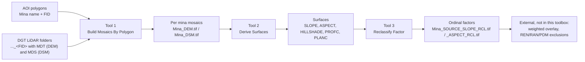

# lidar-terrain-arcgis-tools

> ArcGIS Pro Python toolbox that derives topographic factors (slope, aspect, hillshade, curvature) from DGT LiDAR DEM and DSM, per mining area, for a renewable energy suitability MCDA.

[](https://www.esri.com/en-us/arcgis/products/arcgis-pro/overview)
[](https://www.python.org)
[](https://www.esri.com/en-us/arcgis/products/arcgis-spatial-analyst/overview)
[](https://www.esri.com/en-us/arcgis/products/arcgis-image-analyst/overview)
[](https://www.esri.com/en-us/arcgis/products/arcgis-pro/overview)
[](LICENSE)

A single ArcGIS Pro Python Toolbox (`.pyt`) that processes, in batch, DGT LiDAR elevation data to generate topographic factors for a multicriteria suitability analysis (MCDA) for renewable energy (solar PV focus) on abandoned mining areas in mainland Portugal.

This toolbox is the **factor engine only**. The weighted overlay and the REN/RAN/PDM exclusions are downstream steps done elsewhere and are NOT part of this toolbox. Project CRS: ETRS89 / PT-TM06 (EPSG:3763), meters, Z factor 1.

## Contents

[Summary](#summary) - [Method](#method) - [Requirements](#requirements) - [Installation](#installation) - [Usage](#usage) - [Naming convention](#naming-convention) - [Example](#example) - [Tests](#tests) - [Troubleshooting](#troubleshooting) - [Limitations and notes](#limitations-and-notes) - [Contributing](#contributing) - [Citation](#citation) - [License](#license)

---

## Summary

Three tools form a pipeline, run in order, with the input and output folders always chosen explicitly by the user:

1. **Build Mosaics By Polygon** (Mosaicking): one DEM and one DSM mosaic per mining area, from the DGT LiDAR download folders.
2. **Derive Surfaces** (Surfaces): slope, aspect, hillshade and curvature (profile and plan) from each mosaic.
3. **Reclassify Factor** (Reclassification): ordinal integer classes for slope and aspect, defined in a value table.

Every output is named by a single, consistent convention (see [Naming convention](#naming-convention)) so each tool can find and parse what the previous one produced.

---

## Method



- The DGT LiDAR arrives pre-split into one download folder per area of interest, where the folder name ends in the AOI feature FID and holds the tiles in `MDT*` (terrain, DEM) and `MDS*` (surface, DSM) subfolders. The 5 km buffer selection was already applied at download time.
- **Tool 1** groups AOI features by mina name (the folder number equals the feature FID), merges each mina's MDT and MDS tiles across all of its folders into one DEM and one DSM mosaic, and deduplicates tiles by name. It optionally verifies, per folder, that the tile extent contains the AOI polygon centroid (a guard against a wrong FID mapping).
- **Tool 2** derives the selected surfaces with Spatial Analyst (and Image Analyst for the multidirectional hillshade). Slope is in degrees; aspect uses the Esri convention with -1 for flat; curvature produces profile and plan.
- **Tool 3** reclassifies slope and aspect into ordinal integer classes using `[min, max)` semantics (the last class inclusive at the top), implemented in numpy for deterministic boundaries. The value table validation fails loud on gaps and on overlaps between different class ids before anything is written.
- EPSG is explicit in code and in the logs. Mosaics inherit the tiles CRS (EPSG:3763); the AOI layer, which may be in a different CRS, is projected only for the extent check.

---

## Requirements

- ArcGIS Pro **3.7**, Windows (arcpy is Windows only on ArcGIS Pro 3.x). Uses the Python bundled with ArcGIS Pro and numpy from that environment; no extra packages.
- **Spatial Analyst** extension for Tool 2 (slope, aspect, curvature, traditional hillshade).
- **Image Analyst** extension for Tool 2 only when the hillshade type is Multidirectional.
- Tool 1 and Tool 3 need no extension (mosaicking is core, and the reclassification is pure numpy).
- Tiles in the project CRS, ETRS89 / PT-TM06 (EPSG:3763). The tools log the CRS and warn if it differs.

---

## Installation

1. In *Catalog*, right-click a folder, choose **Add Toolbox**, and select `MiningTerrainToolbox.pyt`.
2. The three tools appear under the **Mining Terrain Factor Toolbox**, in the toolsets **Mosaicking**, **Surfaces** and **Reclassification**.

No installation beyond *Add Toolbox*: the script runs on the Python bundled with ArcGIS Pro. To remove it, right-click the toolbox in *Catalog* and choose *Remove*.

---

## Usage

Run the tools in order. Each tool takes its input from the previous tool's output folder; nothing is inferred by hidden convention.

### Tool 1, Build Mosaics By Polygon

One DEM and one DSM mosaic per mina, merging all of that mina's download folders.

| Parameter | Description |
| --- | --- |
| AOI layer | Polygon layer whose FID numbers the download folders. Carries the `Mina` name field. |
| Mina name field | Field that names the output (sanitized: accents and special characters removed). |
| LiDAR root folder | Folder that contains the `..._<FID>` download folders. |
| Output folder | Where the mosaics are written. |
| Output structure | `per_mina_subfolder` (default) or `flat`. |
| Products | `BOTH` (default), `DEM`, or `DSM`. |
| Pixel type | Default `32_BIT_FLOAT` (DGT LiDAR is float). |
| Mosaic method | For overlaps; `FIRST` recommended for contiguous tiles. |
| Overwrite existing outputs | Off skips existing mosaics. |
| Skip minas with missing folders | On (default) skips minas whose folders are not all present yet. |
| Verify folder extent against AOI polygon | On (default) checks each folder maps to the right mina. |
| Folder name prefix | Optional. Leave blank to auto-detect the prefix from the data folders. |

### Tool 2, Derive Surfaces

Topographic surfaces from the Tool 1 mosaics. Each surface has its own checkbox (all on by default).

| Parameter | Description |
| --- | --- |
| Input mosaics folder | The Tool 1 output. |
| Recurse subfolders | On (default) finds the `per_mina_subfolder` layout. |
| Output structure | `same_as_input` (default; each surface is written next to its input mosaic), `per_mina_subfolder`, or `flat`. |
| Output folder | Only for `per_mina_subfolder` or `flat`; greyed out and not needed for `same_as_input`. |
| Source | `BOTH` (default), `DEM`, or `DSM`. |
| Slope, Aspect, Hillshade, Profile curvature, Plan curvature | One checkbox each. |
| Z factor | Default 1 (project is metric). |
| Hillshade type | `Multidirectional` (default, Image Analyst) or `Traditional`. |
| Hillshade azimuth, altitude | Traditional hillshade only. |
| Overwrite existing outputs | Off skips existing surfaces. |

### Tool 3, Reclassify Factor

Ordinal classes for slope and aspect, from a value table.

| Parameter | Description |
| --- | --- |
| Input factor rasters folder | The Tool 2 output. |
| Recurse subfolders | On (default). |
| Factor to process | `BOTH` (default), `SLOPE`, or `ASPECT`. |
| Slope classes, Aspect classes | Value tables of `class_id`, `min`, `max`. `[min, max)`, last class inclusive at the top. |
| Flat class value | Optional. Class for the Aspect Flat (-1). |
| Output structure | `same_as_input` (default; each reclassified raster is written next to its input), `per_mina_subfolder`, or `flat`. |
| Output folder | Only for `per_mina_subfolder` or `flat`; greyed out and not needed for `same_as_input`. |
| Unmapped values to NoData | On (default). Off makes any cell outside all classes a fail loud error. |
| Overwrite existing outputs | Off skips existing reclassified rasters. |

The value table allows the **same `class_id` on multiple rows**, which supports the circular aspect (for example North split into `315 to 360` and `0 to 45`, both class id 1). The tool does not detect wraparound; you partition the circle into linear rows. The validation fails loud on a gap, on an overlap between different class ids, on a non integer class id, and on `min` not less than `max`, before any raster is written.

---

## Naming convention

A single convention links the three tools:

- Mosaic: `{Mina}_{SOURCE}` where SOURCE is `DEM` or `DSM`.
- Surface: `{Mina}_{SOURCE}_{PRODUCT}` where PRODUCT is `SLOPE`, `ASPECT`, `HILLSHADE`, `PROFC` or `PLANC`.
- Reclassified: the surface name plus `_RCL`.

The `.tif` extension is added on write. Mina names are sanitized for ArcGIS and the file system (accents and c cedilla folded to ASCII, separators to underscore). If two different minas sanitize to the same name they get a numeric suffix; several AOI polygons of the **same** mina are merged into one output.

| Stage | Example output |
| --- | --- |
| Mosaic (DEM) | `Sao_Domingos_DEM.tif` |
| Surface (slope) | `Sao_Domingos_DEM_SLOPE.tif` |
| Reclassified (aspect) | `Sao_Domingos_DEM_ASPECT_RCL.tif` |

---

## Example

A real Tool 1 run over 22 selected AOI features (the AOI layer was in EPSG:102164 and was projected only for the extent check; the mosaics inherit the tiles CRS, EPSG:3763). The 22 features resolved to 21 minas, because one mina (`Cortes Pereira`) has two AOI polygons that were merged into a single output.

Abbreviated geoprocessing log:

```text
AOI layer CRS: EPSG:102164.
AOI layer is EPSG:102164, not the project EPSG:3763. Polygons are projected for the extent check only.
Sanitized mina name 'Defesa das Mercês' to 'Defesa_das_Merces'.
Sanitized mina name 'Preguiça' to 'Preguica'.
Mina 'Alcaria_Queimada' (DEM): mosaicked 112 tiles from 1 folder(s) -> Alcaria_Queimada_DEM.tif
Mina 'Alcaria_Queimada' (DSM): mosaicked 112 tiles from 1 folder(s) -> Alcaria_Queimada_DSM.tif
Mina 'Cortes_Pereira' (DEM): mosaicked 95 tiles from 2 folder(s) -> Cortes_Pereira_DEM.tif
Mina 'Cortes_Pereira' (DSM): mosaicked 95 tiles from 2 folder(s) -> Cortes_Pereira_DSM.tif
...
Done. Minas: 21. Built now: 21. Already present: 0. Mosaics created: 42. Skipped (no data: 0, incomplete: 0, no tiles: 0, extent mismatch: 0).
```

You then point Tool 2 at this output folder to derive the surfaces, and Tool 3 at the Tool 2 output to reclassify slope and aspect.

---

## Tests

The shared helpers have pure unit tests inside the toolbox file, runnable outside ArcGIS:

```text
python MiningTerrainToolbox.pyt
```

This exercises name sanitization and collision handling, the output name build and parse round trip, the value table validation (gaps, overlaps, repeated class id), the mina grouping, the folder prefix auto-detection, the VRT extent parsing, and the numpy reclassification logic (the numpy tests are skipped if numpy is not installed in the Python being used). Under ArcGIS Pro the test block does not run; ArcGIS imports the module, it does not execute it as a script.

---

## Troubleshooting

| Message in the geoprocessing log | Cause | Fix |
| --- | --- | --- |
| `No LiDAR data folders ... found` | LiDAR root does not contain folders with `MDT*`/`MDS*` | Point at the folder that contains the `..._<FID>` download folders. |
| `Cannot auto-detect a folder prefix ...` | Folder names are inconsistent or have no trailing FID number | Set the folder prefix explicitly. |
| `... missing folders for FIDs ...` (skipped) | A mina's download folders are not all present yet | Re-run after the download finishes (keep Skip incomplete on). |
| `... does not contain its AOI polygon centroid` | A folder likely maps to the wrong mina | Check the FID to folder mapping, or turn the extent check off to isolate. |
| `Spatial Analyst extension is not available` | Tool 2 has no Spatial Analyst license | Enable Spatial Analyst in *Project > Licensing*. |
| `Multidirectional hillshade needs the Image Analyst extension` | Tool 2 multidirectional without Image Analyst | Enable Image Analyst, or choose Traditional, or turn hillshade off. |
| `Gap in coverage between ...` / `Overlap between different classes ...` | Tool 3 value table is not a clean tiling | Fix the class intervals so they tile the range with no holes or cross class overlaps. |
| `Class id 9999 collides with the NoData value ...` | A class id or flat class equals the reserved NoData | Use a different class id. |

---

## Limitations and notes

- **The ordinal scale is not harmonized between factors.** You define arbitrary intervals per factor; only slope and aspect are reclassified. Harmonizing the classes for a weighted overlay is the downstream MCDA step, outside this toolbox. *Document this for whoever consumes the outputs, to avoid misuse.*
- **Weighted overlay and the REN/RAN/PDM exclusions are external** and are not part of this toolbox.
- **Folder layout assumption (Tool 1):** the download folder number must equal the AOI feature FID (0 based shapefile FID). Loading the AOI as a geodatabase feature class (1 based OBJECTID) can shift the mapping; the tool warns when the OID field is not `FID`.
- **Memory (Tool 3):** each factor raster is read into memory for the numpy reclassification. The per mina extents are tolerable; a very large raster can exceed memory, and the tool then aborts with a clear message.
- **Datum reprojection:** `projectAs` uses the default transformation. Where no default geographic transformation exists between datums it may need to be specified; unlikely in mainland Portugal.
- **Aspect Flat:** aspect uses -1 for flat. In Tool 3 the optional flat class wins over any class interval that happens to contain -1.

---

## Contributing

Issues and pull requests are welcome. When reporting a problem, please include:

- ArcGIS Pro version (Help > About).
- The tool, its parameters, and the input CRS and EPSG code (the tools print the CRS in the log).
- The tail of the geoprocessing log, including the final `Done. ...` summary line.
- A minimal dataset or description that reproduces the issue, if possible.

---

## Citation

If you use this toolbox, please cite it via the metadata in [`CITATION.cff`](CITATION.cff) (GitHub renders this in the sidebar as "Cite this repository"). A versioned DOI is minted via Zenodo for each GitHub release.

---

## License

GNU General Public License v3.0 or later. See [LICENSE](LICENSE).
