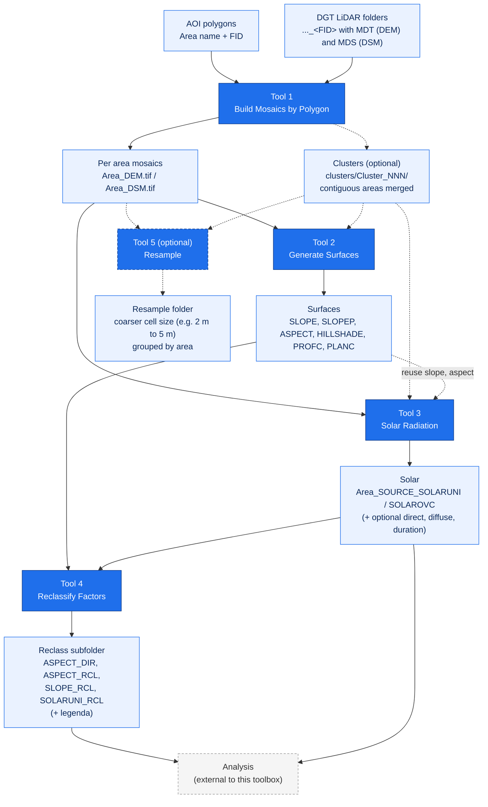

# lidar-terrain-arcgis-tools

> ArcGIS Pro Python toolbox that derives topographic factors (slope, aspect, hillshade, curvature, solar radiation) from LiDAR DEM and DSM, in batch, per area of interest.

[](https://www.esri.com/en-us/arcgis/products/arcgis-pro/overview)
[](https://www.python.org)
[](https://www.esri.com/en-us/arcgis/products/arcgis-spatial-analyst/overview)
[](https://www.esri.com/en-us/arcgis/products/arcgis-image-analyst/overview)
[](https://www.esri.com/en-us/arcgis/products/arcgis-pro/overview)
[](LICENSE)

A single ArcGIS Pro Python Toolbox (`.pyt`) that processes, in batch, LiDAR elevation data (DEM and DSM), per area of interest, to generate topographic factors: slope, aspect, hillshade, profile and plan curvature, and annual solar radiation. Every output follows one consistent naming convention so it can feed any downstream analysis.

This toolbox is the **factor engine only**. Any downstream analysis (suitability modeling, factor weighting, exclusion masks) is done elsewhere and is NOT part of this toolbox. Project CRS: ETRS89 / PT-TM06 (EPSG:3763), meters, Z factor 1.

## Contents

[Summary](#summary) - [Method](#method) - [Requirements](#requirements) - [Data source](#data-source) - [Installation](#installation) - [Usage](#usage) - [Naming convention](#naming-convention) - [Example](#example) - [Tests](#tests) - [Troubleshooting](#troubleshooting) - [Limitations and notes](#limitations-and-notes) - [Contributing](#contributing) - [Citation](#citation) - [License](#license)

---

## Summary

Four tools form the pipeline, run in order, with the input and output folders always chosen explicitly by the user. A fifth tool, Resample, is an optional utility you can run on any of the outputs:

1. **Build Mosaics by Polygon**: one DEM and one DSM mosaic per area of interest, from the DGT LiDAR download folders.
2. **Generate Surfaces**: slope (degrees and percent), aspect, hillshade and curvature (profile and plan) from each mosaic.
3. **Solar Radiation**: annual solar radiation (global, kWh/m2) per area on the DEM with RasterSolarRadiation (GPU), with a choice of diffuse model (uniform, overcast, or both) and optional direct, diffuse and duration outputs, at the native 2 m baseline.
4. **Reclassify Factors**: fixed suitability classes for aspect, slope and annual solar (aspect yields two rasters, quadrants and solar suitability), written to a `Reclass` subfolder with a legend.
5. **Resample** (optional): resample the named rasters to a coarser cell size, for example 2 m to 5 m, into a `Resample` folder grouped by area.

Every output is named by a single, consistent convention (see [Naming convention](#naming-convention)) so each tool can find and parse what the previous one produced.

---

## Method



- The DGT LiDAR arrives pre-split into one download folder per area of interest, where the folder name ends in the AOI feature FID and holds the tiles in `MDT*` (terrain, DEM) and `MDS*` (surface, DSM) subfolders. The 5 km buffer selection was already applied at download time.
- **Tool 1** groups AOI features by area name, then maps each area to its download folder. By default it maps **by geometry** (the folder whose tile extent is centered on the area), which is robust to a shapefile whose FID order no longer matches the folder numbering done at download time; a **by FID number** option keeps the older folder-number mapping. It merges each area's MDT and MDS tiles across its folders into one DEM and one DSM mosaic, deduplicating tiles by name. An optional clustering mode also aggregates contiguous areas (touching or overlapping AOI polygons) into one mosaic per cluster, written to a `clusters` subfolder, each with a `Cluster_NNN_members.txt` manifest.
- **Tool 2** derives the selected surfaces with Spatial Analyst (and Image Analyst for the multidirectional hillshade). Slope is in degrees, and optionally percent; aspect uses the Esri convention with -1 for flat; curvature produces profile and plan.
- **Tool 3** computes annual solar radiation (kWh/m2) on the DEM with RasterSolarRadiation (GPU accelerated), at the native 2 m baseline. You pick the diffuse model (uniform, overcast, or both) and can also output the direct, diffuse and direct duration rasters; the output names carry the model (`SOLARUNI`, `SOLAROVC`). A coarser solar cell size resamples the DEM first.
- **Tool 4** reclassifies aspect, slope and the annual solar raster into fixed project suitability classes, in numpy with `[min, max)` semantics. Aspect yields two rasters: quadrants (`ASPECT_DIR`, N to NW plus flat) and solar suitability (`ASPECT_RCL`, south and flat best); slope and solar yield `SLOPE_RCL` and `SOLARUNI_RCL`. Each output, plus a legend (`RECLASS_legenda.txt`), goes to a `Reclass` subfolder next to the inputs.
- **Tool 5** (optional) resamples the selected data types to a target cell size with core Resample, writing to a `Resample` folder grouped by area; continuous rasters use bilinear, reclassified (`_RCL`) rasters use nearest. Typical use is 2 m to 5 m to lighten the later steps.
- EPSG is explicit in code and in the logs. Mosaics inherit the tiles CRS (EPSG:3763); the AOI layer, which may be in a different CRS, is projected only for the extent check.

---

## Requirements

- ArcGIS Pro **3.7**, Windows (arcpy is Windows only on ArcGIS Pro 3.x). Uses the Python bundled with ArcGIS Pro and numpy from that environment; no extra packages.
- **Spatial Analyst** extension for Tool 2 (slope, aspect, curvature, traditional hillshade) and Tool 3 (solar radiation). RasterSolarRadiation uses the GPU when available and falls back to the CPU.
- **Image Analyst** extension for Tool 2 only when the hillshade type is Multidirectional.
- Tools 1, 4 and 5 need no extension (mosaicking and resampling are core, and the reclassification is pure numpy).
- Tiles in the project CRS, ETRS89 / PT-TM06 (EPSG:3763). The tools log the CRS and warn if it differs.

---

## Data source

The tools were built for the DGT LiDAR survey of mainland Portugal, *Levantamento LiDAR de Portugal Continental*, produced by the [Direção-Geral do Território (DGT)](https://www.dgterritorio.gov.pt/levantamento-lidar-de-portugal-continental-0). The survey provides a 10 points/m2 LAZ point cloud and the derived terrain model (MDT, the DEM) and surface model (MDS, the DSM) at 0.5 m and 2 m resolution as GeoTIFF, under an open data policy with no usage restrictions. This project used the 2 m models (`MDT-2m`, `MDS-2m`), but the tools are not tied to a resolution: Tool 1 mosaics any `MDT*` and `MDS*` tiles, so the 0.5 m models (`MDS-50cm-...`) work as well. When a download folder holds more than one resolution, set Tool 1's *Tile resolution* parameter (for example `2m` or `50cm`) to pick one; left blank it auto-detects a single resolution and fails loud on a mix, so a mosaic never blends cell sizes.

The data is distributed through the DGT Data Center (CDD), which requires a free registration: <https://cdd.dgterritorio.gov.pt/dgt-fe>.

The tiles used here were downloaded with the [DGT CDD Downloader](https://plugins.qgis.org/plugins/dgt_cdd_downloader/) plugin for QGIS (Duarte Carreira, Hugo Santos and Pedro Venâncio). It authenticates against the CDD portal, splits a large area into chunks, organizes the files per area, and can build a per folder VRT. That is the exact on disk layout Tool 1 expects: one download folder per area of interest, each with `MDT*` and `MDS*` subfolders and a per product `.vrt`.

> The factor tools (2 to 4) work on any DEM and DSM raster. Only Tool 1 (mosaicking) is tailored to the DGT download folder layout described above.

---

## Installation

1. In *Catalog*, right-click a folder, choose **Add Toolbox**, and select `LidarTerrainToolbox.pyt`.
2. The tools appear at the root of the **LiDAR Terrain Toolbox**, with numbered labels (01, 02, ...) so they run in pipeline order.

No installation beyond *Add Toolbox*: the script runs on the Python bundled with ArcGIS Pro. To remove it, right-click the toolbox in *Catalog* and choose *Remove*.

---

## Usage

Run the tools in order. Each tool takes its input from the previous tool's output folder; nothing is inferred by hidden convention.

### Tool 1, Build Mosaics By Polygon

One DEM and one DSM mosaic per area, merging all of that area's download folders.

| Parameter | Description |
| --- | --- |
| AOI layer | Polygon layer for the areas of interest, carrying the `Area` name field. |
| Area name field | Field that names the output (sanitized: accents and special characters removed). |
| LiDAR root folder | Folder that contains the `..._<FID>` download folders. |
| Output folder | Where the mosaics are written. |
| Output structure | `per_area_subfolder` (default) or `flat`. |
| Products | `BOTH` (default), `DEM`, or `DSM`. |
| Pixel type | Default `32_BIT_FLOAT` (DGT LiDAR is float). |
| Mosaic method | For overlaps; `FIRST` recommended for contiguous tiles. |
| Overwrite existing outputs | Off skips existing mosaics. |
| Skip areas with missing folders | On (default) skips areas whose folders are not all present yet. |
| Verify folder extent against AOI polygon | On (default) checks each folder maps to the right area; skipped under by-geometry mapping, which already guarantees it. |
| Folder name prefix | Optional. Leave blank to auto-detect the prefix from the data folders. |
| Tile resolution | Optional. Leave blank to auto-detect; set (for example `2m` or `50cm`) to pick one resolution when a folder holds more than one. |
| Also build overlap clusters | Off by default. Also aggregates contiguous areas (touching or overlapping AOI polygons) into one mosaic per cluster, alongside the per area output. |
| Report clusters only | Dry-run for clustering: lists the clusters and member counts without building any mosaic. |
| Folder to area mapping | `by geometry` (default; maps each area to the folder whose tile extent is centered on it, robust to FID renumbering) or `by FID number` (the folder named with the area FID). |

With **overlap clustering** on, Tool 1 also groups areas whose AOI polygons are contiguous (touch or overlap) into one mosaic per cluster, in parallel to the per area output, which is unchanged. Every area belongs to exactly one cluster (a non overlapping area is its own one member cluster). Clusters go to a `clusters` subfolder, named `Cluster_NNN` by the smallest member FID, each with a `Cluster_NNN_members.txt` manifest listing the member areas (the ids renumber if the AOI is edited, so the manifest is the authority). Tiles shared between areas are deduplicated by name. Run the dry-run first to see the clusters before the heavy build.

### Tool 2, Generate Surfaces

Topographic surfaces from the Tool 1 mosaics. Each surface has its own checkbox (all on by default).

| Parameter | Description |
| --- | --- |
| Input mosaics folder | The Tool 1 output. |
| Recurse subfolders | On (default) finds the `per_area_subfolder` layout. |
| Output structure | `same_as_input` (default; each surface is written next to its input mosaic), `per_area_subfolder`, or `flat`. |
| Output folder | Only for `per_area_subfolder` or `flat`; greyed out and not needed for `same_as_input`. |
| Source | `BOTH` (default), `DEM`, or `DSM`. |
| Slope (degrees), Slope (percent), Aspect, Hillshade, Profile curvature, Plan curvature | One checkbox each; slope percent is off by default. |
| Z factor | Default 1 (project is metric). |
| Hillshade type | `Multidirectional` (default, Image Analyst) or `Traditional`. |
| Hillshade azimuth, altitude | Traditional hillshade only. |
| Overwrite existing outputs | Off skips existing surfaces. |

### Tool 3, Solar Radiation

Annual solar radiation (global, kWh/m2) per area, with `RasterSolarRadiation` (GPU when available). Choose the diffuse model and which rasters to output. The baseline runs at the native 2 m cell size; a coarser solar cell size resamples the DEM first. This is the heavy tool; expect long run times.

| Parameter | Description |
| --- | --- |
| Input mosaics folder | The Tool 1 output. |
| Recurse subfolders | On (default). |
| Output structure, Output folder | `same_as_input` default, as in the other tools. |
| Source | `DEM` (default, the terrain resource for ground PV), `DSM`, or `BOTH`. |
| Solar cell size | Meters to resample the DEM to before the run; default `0` (native 2 m baseline). A value above the native size resamples first. |
| Resample method | `BILINEAR` (default). |
| Year | Whole year; the year only sets the leap year. |
| Shadow neighborhood distance | How far to look for terrain shadows; default `1000 Meters`, adaptive. |
| Transmittivity, Diffuse proportion | Atmosphere; defaults 0.6 and 0.3 (clear-sky conditions). |
| Diffuse model type | `UNIFORM_SKY` (default), `STANDARD_OVERCAST_SKY`, or `BOTH`. `BOTH` runs both and writes `SOLARUNI` and `SOLAROVC`. |
| Output Direct, Diffuse, Direct Duration | One checkbox each, on by default; written as `..._SOLARUNIDIR`, `_SOLARUNIDIF`, `_SOLARUNIDUR` (and the `_SOLAROVC` equivalents). Duration is in hours, the rest in kWh/m2. |
| Reuse Tool 2 slope and aspect | Off by default. On native runs only, passes the existing SLOPE and ASPECT rasters so they are not recomputed; guarded on cell size and CRS. Validate with an A/B run first. |
| Sun map grid level | Valid 5 to 7; default 7. The sun map (H3 grid) resolution that sets the accuracy of the annual total: higher is more accurate and slower. This, not the time interval, is the precision lever. |
| Calculate insolation from time intervals | Off by default (a single annual total). On computes per-interval values and returns a multiband raster (one band per interval); set the interval unit (`MINUTE`, `HOUR`, `DAY`, `WEEK`) and value. Default `DAY` / 14. |
| Overwrite | Off skips existing outputs. |

Running at the native 2 m with the default 1000 m shadow neighborhood and sun map grid level 7 is the heaviest combination (about 25 million cells per area, with a 500 cell shadow radius), so each area takes much longer than at a coarser cell size. Benchmark one area first.

### Tool 4, Reclassify Factors

Fixed project suitability classes for aspect, slope and the annual solar raster (`SOLARUNI`), in batch. The schemes are fixed in the code (one place to edit), so there is no value table to fill. Each output, plus a legend, goes to a `Reclass` subfolder next to the inputs.

| Parameter | Description |
| --- | --- |
| Input results folder | The folder whose rasters to reclassify (Tool 2 and Tool 3 outputs, native or resampled). |
| Recurse subfolders | On (default); the `Reclass` subfolders are skipped on discovery. |
| Factors to reclassify | Multi-select of `ASPECT`, `SLOPE`, `SOLAR`; default all. |
| Overwrite existing outputs | Off skips existing reclassified rasters. |

Aspect yields **two** rasters; slope and solar one each. The boundaries are `[min, max)` (the top class inclusive), in numpy; NoData is 9999.

| Output | Classes |
| --- | --- |
| `..._ASPECT_DIR` | Quadrants (45 deg bins): N=1, NE=2, E=3, SE=4, S=5, SW=6, W=7, NW=8, Plano=9. |
| `..._ASPECT_RCL` | Solar suitability (60 deg sectors): Norte=1, NE/NW=2, SE/SW=3, Sul and Plano=4. |
| `..._SLOPE_RCL` | 1 if slope <= 14.04 deg (25 percent), else 0. |
| `..._SOLARUNI_RCL` | <1200=1, 1200-1400=2, 1400-1600=3, 1600-1800=4, 1800-2000=5, >=2000=6 (kWh/m2). |

A `RECLASS_legenda.txt` in each `Reclass` subfolder lists the files written and this class matrix.

### Tool 5, Resample

Resample the named rasters to a coarser cell size (for example 2 m to 5 m), in batch. An optional utility; point it at any folder of mosaics or surfaces. Outputs go to a `Resample` folder inside the results root, grouped by area, with the file names unchanged, so the other tools read them the same way.

| Parameter | Description |
| --- | --- |
| Results folder | The results root; a `Resample` subfolder is created inside it. |
| Recurse subfolders | On (default) finds the `per_area_subfolder` layout. |
| Data types to resample | Multi-select of the sources (`DEM`, `DSM`), the surfaces (`SLOPE`, `SLOPEP`, `ASPECT`, ...), the solar variants, and the `_RCL` factors. The list is derived from the naming convention, so new products appear automatically. Default `DEM`, `DSM`. |
| Target cell size (meters) | Default 5. |
| Overwrite existing outputs | Off skips existing resampled rasters. |

The method is automatic per type: bilinear for continuous rasters, nearest for reclassified (`_RCL`) so the ordinal classes are preserved. A raster already at the target cell size is copied through unchanged, so the `Resample` folder stays a complete set; a target finer than the native cell size warns, since upsampling adds no real detail.

---

## Naming convention

A single convention links the tools:

- Mosaic: `{Area}_{SOURCE}` where SOURCE is `DEM` or `DSM`.
- Surface: `{Area}_{SOURCE}_{PRODUCT}` where PRODUCT is `SLOPE` (degrees), `SLOPEP` (percent), `ASPECT`, `HILLSHADE`, `PROFC` or `PLANC`.
- Solar: `{Area}_{SOURCE}_SOLARUNI` or `_SOLAROVC` (global, by diffuse model), with `_SOLARUNIDIR` / `_SOLARUNIDIF` / `_SOLARUNIDUR` (and the `_SOLAROVC` equivalents) for the optional direct, diffuse and duration rasters.
- Reclassified (Tool 4): the suitability rasters go to a `Reclass` subfolder. The surface name plus `_RCL` (`SLOPE_RCL`, `ASPECT_RCL`, `SOLARUNI_RCL`), and the aspect quadrants as `{Area}_{SOURCE}_ASPECT_DIR`.
- Cluster: `Cluster_NNN_{SOURCE}` (overlap clustering), numbered by the smallest member FID; a `Cluster_NNN_members.txt` lists the member areas.

The `.tif` extension is added on write. Area names are sanitized for ArcGIS and the file system (accents and c cedilla folded to ASCII, separators to underscore). If two different areas sanitize to the same name they get a numeric suffix; several AOI polygons of the **same** area are merged into one output.

| Stage | Example output |
| --- | --- |
| Mosaic (DEM) | `Sao_Domingos_DEM.tif` |
| Surface (slope) | `Sao_Domingos_DEM_SLOPE.tif` |
| Reclassified suitability (aspect) | `Reclass/Sao_Domingos_DEM_ASPECT_RCL.tif` |
| Aspect quadrants | `Reclass/Sao_Domingos_DEM_ASPECT_DIR.tif` |

---

## Example

A real run over 38 areas. The AOI layer was in EPSG:102164, projected only for the extent check; the mosaics inherit the tiles CRS, EPSG:3763. One area (`Cortes Pereira`) has two AOI polygons that were merged into a single output. Abbreviated geoprocessing log for the whole pipeline:

```text
# Tool 1, Build Mosaics by Polygon
Auto-detected folder prefix: '02_DGT_LiDAR_Data_'.
Area 'Alcaria_Queimada' (DEM): mosaicked 112 tiles (2m, 2 m) from 1 folder(s) -> Alcaria_Queimada_DEM.tif
Area 'Cortes_Pereira' (DEM): mosaicked 95 tiles (2m, 2 m) from 2 folder(s) -> Cortes_Pereira_DEM.tif
Done. Areas: 38. Built now: 38. Mosaics created: 76. Skipped (no data: 0, incomplete: 0, no tiles: 0, extent mismatch: 0).

# Tool 2, Generate Surfaces
Done. Mosaics processed: 76. Surfaces created: 380.

# Tool 3, Solar Radiation
Alcaria_Queimada (DEM): solar radiation (kWh/m2, EPSG:3763) -> Alcaria_Queimada_DEM_SOLARUNI.tif
Done. Mosaics: 38. Solar rasters created: 38. Skipped existing: 0. Failed: 0.

# Tool 5, Resample (to 10 m)
Alcaria_Queimada (SLOPE): resampled 2 m -> 10 m (BILINEAR, EPSG:3763) -> Alcaria_Queimada_DEM_SLOPE.tif
Alcaria_Queimada (SOLARUNI): already at 10 m, copied -> Alcaria_Queimada_DEM_SOLARUNI.tif
Done. Selected rasters: 494. Resampled: 456. Copied (already at target): 38. Skipped existing: 0. Failed: 0.
```

You then point Tool 2 at this output folder to derive the surfaces, Tool 3 for solar, and Tool 4 at the Tool 2 and Tool 3 outputs to reclassify aspect, slope and solar.

**Processing time.** A full run over the dataset (273 areas grouped into 72 clusters), at the native 2 m: Tool 1 (mosaics, with clustering) about 2 h 21 m; Tool 2 (the six surfaces, DEM and DSM) 51 m; Tool 3 (solar on the GPU, native 2 m, sun map grid level 7, reusing the Tool 2 slope and aspect) 2 h 34 m; Tool 5 (resample to 5 m) 15 m. Roughly 6 hours of compute end to end, with Tool 1 and Tool 3 the heaviest.

---

## Tests

The shared helpers have pure unit tests inside the toolbox file, runnable outside ArcGIS:

```text
python LidarTerrainToolbox.pyt
```

This exercises name sanitization and collision handling, the output name build and parse round trip, the class interval validation and the fixed reclassification schemes, the area grouping, the folder prefix auto-detection, the VRT extent parsing, the tile resolution parsing and selection, the resample type mapping, and the numpy reclassification logic (the numpy tests are skipped if numpy is not installed in the Python being used). Under ArcGIS Pro the test block does not run; ArcGIS imports the module, it does not execute it as a script.

---

## Troubleshooting

| Message in the geoprocessing log | Cause | Fix |
| --- | --- | --- |
| `No LiDAR data folders ... found` | LiDAR root does not contain folders with `MDT*`/`MDS*` | Point at the folder that contains the `..._<FID>` download folders. |
| `Cannot auto-detect a folder prefix ...` | Folder names are inconsistent or have no trailing FID number | Set the folder prefix explicitly. |
| `... missing folders for FIDs ...` (skipped) | An area's download folders are not all present yet | Re-run after the download finishes (keep Skip incomplete on). |
| `... does not contain its AOI polygon centroid` | Under by-FID mapping, a folder maps to the wrong area | Switch Folder to area mapping to `by geometry` (the default), or fix the FID to folder alignment. |
| `Spatial Analyst extension is not available` | Tool 2 has no Spatial Analyst license | Enable Spatial Analyst in *Project > Licensing*. |
| `Multidirectional hillshade needs the Image Analyst extension` | Tool 2 multidirectional without Image Analyst | Enable Image Analyst, or choose Traditional, or turn hillshade off. |

---

## Limitations and notes

- **The ordinal scale is not harmonized between factors.** You define arbitrary intervals per factor; only slope and aspect are reclassified. Harmonizing the classes is a downstream analysis step, outside this toolbox. *Document this for whoever consumes the outputs, to avoid misuse.*
- **The downstream analysis is external** and not part of this toolbox.
- **Folder layout assumption (Tool 1):** the download folder number must equal the AOI feature FID (0 based shapefile FID). Loading the AOI as a geodatabase feature class (1 based OBJECTID) can shift the mapping; the tool warns when the OID field is not `FID`.
- **Memory (Tool 4):** each factor raster is read into memory for the numpy reclassification. The per area extents are tolerable; a very large raster can exceed memory, and the tool then aborts with a clear message.
- **Datum reprojection:** `projectAs` uses the default transformation. Where no default geographic transformation exists between the input and project datums, it may need to be specified explicitly.
- **Aspect Flat:** aspect uses -1 for flat. In Tool 4 the optional flat class wins over any class interval that happens to contain -1.

---

## Contributing

Issues and pull requests are welcome. When reporting a problem, please include:

- ArcGIS Pro version (Help > About).
- The tool, its parameters, and the input CRS and EPSG code (the tools print the CRS in the log).
- The tail of the geoprocessing log, including the final `Done. ...` summary line.
- A minimal dataset or description that reproduces the issue, if possible.

---

## Citation

If you use this toolbox, please cite it via the metadata in [`CITATION.cff`](CITATION.cff) (GitHub renders this in the sidebar as "Cite this repository"). A versioned DOI is minted via Zenodo for each GitHub release.

---

## License

GNU General Public License v3.0 or later. See [LICENSE](LICENSE).
