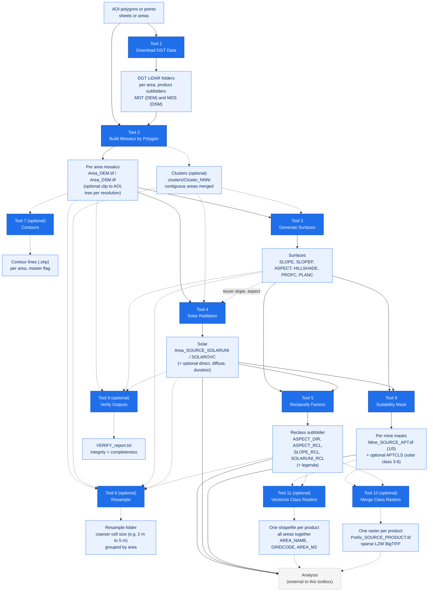

# lidar-terrain-arcgis-tools

> ArcGIS Pro Python toolbox that derives topographic factors (slope, aspect, hillshade, curvature, solar radiation) from LiDAR DEM and DSM, in batch, per area of interest.

[](https://www.esri.com/en-us/arcgis/products/arcgis-pro/overview)
[](https://www.python.org)
[](https://www.esri.com/en-us/arcgis/products/arcgis-spatial-analyst/overview)
[](https://www.esri.com/en-us/arcgis/products/arcgis-image-analyst/overview)
[](https://www.esri.com/en-us/arcgis/products/arcgis-pro/overview)
[](https://epsg.io/3763)
[](LICENSE)
[](https://doi.org/10.5281/zenodo.20694266)
[](https://github.com/PedroMMGoncalves/lidar-terrain-arcgis-tools/releases)
[](https://github.com/PedroMMGoncalves/lidar-terrain-arcgis-tools/actions/workflows/tests.yml)

A single ArcGIS Pro Python Toolbox (`.pyt`) that processes, in batch, LiDAR elevation data (DEM and DSM), per area of interest, to generate topographic factors: slope, aspect, hillshade, profile and plan curvature, and annual solar radiation. Every output follows one consistent naming convention so it can feed any downstream analysis.

This toolbox is the **factor engine only**. Any downstream analysis (suitability modeling, factor weighting, exclusion masks) is done elsewhere and is NOT part of this toolbox. Project CRS: ETRS89 / PT-TM06 (EPSG:3763), meters, Z factor 1.

## Contents

[Quick start](#quick-start) - [Summary](#summary) - [Method](#method) - [Requirements](#requirements) - [Data source](#data-source) - [Installation](#installation) - [Usage](#usage) - [Naming convention](#naming-convention) - [Example](#example) - [Performance](#performance) - [Tests](#tests) - [Troubleshooting](#troubleshooting) - [Limitations and notes](#limitations-and-notes) - [Contributing](#contributing) - [Citation](#citation) - [License](#license)

---

## Quick start

1. **Add the toolbox.** In *Catalog*, right-click a folder, *Add Toolbox*, and pick `LidarTerrainToolbox.pyt`.
2. **Get the data.** Run **Tool 1, Download DGT Data** with your AOI layer and a name field (free CDD account needed), or point at LiDAR you already downloaded with the QGIS DGT CDD plugin.
3. **Build the mosaics.** Run **Tool 2** on the download root to get one DEM and one DSM per area.
4. **Derive the factors.** Run **Tool 3** (surfaces), **Tool 4** (solar), then **Tool 5** (reclassify) on the previous outputs.
5. **Utilities as needed.** **Tool 6** resamples (for example 2 m to 5 m), **Tool 7** draws cartographic contours, **Tool 8** verifies that everything is there and valid, and **Tool 9** builds a binary suitability mask per mine.
6. **Deliver.** **Tool 10** merges the class rasters of a product into one BigTIFF, and **Tool 11** turns them into one shapefile per product with every area together and the areas computed.

Each tool reads the previous tool's output folder and writes with one consistent naming convention. Project CRS is EPSG:3763.

---

## Summary

Five tools form the pipeline, run in order, with the input and output folders always chosen explicitly by the user. Six more are utilities you can run on the outputs:

1. **Download DGT Data**: download the LiDAR tiles from the DGT CDD portal, organized one folder per AOI feature (with a product subfolder each) or as a single flat folder, ready for the mosaic tool.
2. **Build Mosaics by Polygon**: one DEM and one DSM mosaic per area of interest, from the DGT LiDAR download folders.
3. **Generate Surfaces**: slope (degrees and percent), aspect, hillshade and curvature (profile and plan) from each mosaic.
4. **Solar Radiation**: annual solar radiation (global, kWh/m2) per area on the DEM with RasterSolarRadiation (GPU), with a choice of diffuse model (uniform, overcast, or both) and optional direct, diffuse and duration outputs, at the native 2 m baseline.
5. **Reclassify Factors**: fixed suitability classes for aspect, slope and annual solar (aspect yields two rasters, quadrants and solar suitability), written to a `Reclass` subfolder with a legend.
6. **Resample** (optional): resample the named rasters to a coarser cell size, for example 2 m to 5 m, into a `Resample` folder grouped by area.
7. **Contours** (optional): cartographic contour lines from the DEM or DSM mosaics, with a chosen equidistance and a master (index) interval, smoothed for high resolution LiDAR, into a `Contours` subfolder.
8. **Verify Outputs**: read-only integrity check of a results tree; flags corrupt or unreadable rasters, a CRS other than the expected EPSG, and missing expected products per area, with an optional report file.
9. **Suitability Mask**: binary mask per mine, 1 where the slope is at or below a threshold (degrees or percent) and the annual solar radiation is at or above a minimum, clipped to each mine polygon; optionally also a second raster with the suitable cells graded by solar class (1 to 6).
10. **Merge Class Rasters** (optional): merge the per area class rasters of a product into one raster covering every area, written as a sparse LZW BigTIFF so a scattered set of areas does not blow up.
11. **Vectorize Class Rasters** (optional): convert the class rasters to polygons, every area merged into one shapefile per product, with the area name, the class value and the polygon area in square meters.

Every output is named by a single, consistent convention (see [Naming convention](#naming-convention)) so each tool can find and parse what the previous one produced.

---

## Method



- **Tool 1** downloads the DGT LiDAR per AOI feature: it takes the feature envelope in WGS84 (a clean square for points) and searches the CDD STAC API by that bounding box. It offers two output layouts: one folder per area (named by a chosen field) with a product subfolder each (`MDT-2m`, `MDS-2m`, `MDT-50cm`, `MDS-50cm`, `LAZ`), ready for Tool 2, or a single flat folder with all tiles together. Tiles download one product at a time, in a fixed order, with each tile logged.
- The DGT LiDAR is organized as one download folder per area of interest, holding the tiles in `MDT*` (terrain, DEM) and `MDS*` (surface, DSM) subfolders. Tool 1 names each folder by your chosen field; the QGIS plugin numbered it by the AOI feature FID; Tool 2 maps by name, by geometry, or by FID accordingly. The spatial selection (for example a buffer around the AOI) is applied upstream, so Tool 2 does no buffering or tile intersection.
- **Tool 2** groups AOI features by area name, then maps each area to its download folder. By default it maps **by name** (the folder whose name equals the sanitized area name, the exact pairing for Tool 1 output); **by geometry** (the folder whose tile extent is centered on the area) and **by FID number** (the folder numbered with the area FID, the old plugin layout) are there for folders not named by the area. It merges each area's MDT and MDS tiles across its folders into one DEM and one DSM mosaic, deduplicating tiles by name, and can optionally **clip each mosaic to its AOI**, either to the extent (an exact, fast cut for a rectangular cartogram sheet) or to the true polygon shape (for irregular AOIs such as mine polygons). When both DGT resolutions are selected it builds one output tree per resolution (`out/2m`, `out/50cm`), same file names inside each. An optional clustering mode also aggregates contiguous areas (touching or overlapping AOI polygons) into one mosaic per cluster, written to a `clusters` subfolder, each with a `Cluster_NNN_members.txt` manifest.
- **Tool 3** derives the selected surfaces with Spatial Analyst (and Image Analyst for the multidirectional hillshade). Slope is in degrees, and optionally percent; aspect uses the Esri convention with -1 for flat; curvature produces profile and plan.
- **Tool 4** computes annual solar radiation (kWh/m2) on the DEM with RasterSolarRadiation (GPU accelerated), at the native 2 m baseline. You pick the diffuse model (uniform, overcast, or both) and can also output the direct, diffuse and direct duration rasters; the output names carry the model (`SOLARUNI`, `SOLAROVC`). A coarser solar cell size resamples the DEM first.
- **Tool 5** reclassifies aspect, slope and the annual solar raster into fixed project suitability classes, in numpy with `[min, max)` semantics. Aspect yields two rasters: quadrants (`ASPECT_DIR`, N to NW plus flat) and solar suitability (`ASPECT_RCL`, south and flat best); slope and solar yield `SLOPE_RCL` and `SOLARUNI_RCL`. Each output, plus a legend (`RECLASS_legenda.txt`), goes to a `Reclass` subfolder next to the inputs.
- **Tool 6** (optional) resamples the selected data types to a target cell size with core Resample, writing to a `Resample` folder grouped by area; continuous rasters use bilinear, reclassified (`_RCL`) rasters use nearest. Typical use is 2 m to 5 m to lighten the later steps.
- **Tool 7** (optional) generates cartographic contour lines from the DEM or DSM mosaics: it smooths the surface (Focal mean, given in meters so it is resolution independent), contours at the chosen equidistance, smooths the lines (PAEK), flags the master (index) contours and drops the short noise rings, writing one polyline shapefile per area to a `Contours` subfolder. Needs Spatial Analyst.
- **Tool 8** verifies a results tree without writing anything (except an optional report): every `.tif` must have a valid GeoTIFF signature, open in arcpy, and match the expected EPSG; every area with a base mosaic must have the expected products. The `Resample` tree is checked for integrity but not completeness.
- **Tool 9** builds the final binary suitability mask per mine: `1` where slope <= the threshold AND `SOLARUNI` >= the minimum (default 1400 kWh/m2, the lower bound of solar class 3), else `0`, computed on the area raster that covers each mine (matched by name, else spatially) and clipped to the mine polygons (same-name polygons are one mine). The slope threshold unit picks the slope raster and the comparison runs in its own units: `percent` reads the `SLOPEP` raster, `degrees` reads `SLOPE`. Output `<Mine>_<SOURCE>_APT.tif`, and optionally `<Mine>_<SOURCE>_APTCLS.tif`, the mask multiplied by the annual solar radiation reclassified into classes 1 to 6, so suitable cells keep their solar class (3 to 6) and the rest is 0. When an input exists in more than one resolution tree, it uses the finest available for both slope and solar. The weighted overlay and the REN/RAN/PDM exclusions remain outside this toolbox.
- **Tool 10** (optional) merges the per area class rasters of each selected product into one raster covering every area (`<Prefix>_<SOURCE>_<PRODUCT>.tif`). Only class rasters are merged, never a continuous surface. Because the areas of interest are scattered, the merged grid spans their whole bounding box and is almost all NoData, so it is written with GDAL as a **sparse, LZW compressed BigTIFF**: the empty blocks are never written and cost nothing. Without gdal (`osgeo`) it falls back to core `MosaicToNewRaster`, which writes every block, and warns accordingly.
- **Tool 11** (optional) polygonizes the class rasters and merges **every area into one shapefile per product**, carrying the area name, the class value and the polygon area in square meters. For scattered areas this is the container that stays small and answers "how many hectares are suitable" directly, which a merged raster cannot.
- EPSG is explicit in code and in the logs. Mosaics inherit the tiles CRS (EPSG:3763); the AOI layer, which may be in a different CRS, is projected only for the extent checks and clips, deliberately without a datum shift (see [Limitations and notes](#limitations-and-notes)).

---

## Requirements

- ArcGIS Pro **3.7**, Windows (arcpy is Windows only on ArcGIS Pro 3.x). Uses the Python bundled with ArcGIS Pro and numpy from that environment; no extra packages.
- **Spatial Analyst** extension for Tool 3 (slope, aspect, curvature, traditional hillshade), Tool 4 (solar radiation), Tool 7 (contours: Contour and Focal Statistics; Smooth Line is core), and Tool 9 (suitability mask: Con and Extract By Mask). RasterSolarRadiation uses the GPU when available and falls back to the CPU.
- **Image Analyst** extension for Tool 3 only when the hillshade type is Multidirectional.
- **Network access, a free CDD account, and the `requests` library** (bundled with ArcGIS Pro) for Tool 1 (Download DGT Data).
- Tools 1, 2, 5, 6, 8, 10 and 11 need no extension (download, mosaicking, resampling, verification, merging and vectorizing are core, and the reclassification is pure numpy).
- **gdal (`osgeo`)**, bundled with ArcGIS Pro, for the sparse BigTIFF in Tool 10 (and the optional VRT in Tool 1). Both fall back or warn cleanly when it is missing.
- Tiles in the project CRS, ETRS89 / PT-TM06 (EPSG:3763). The tools log the CRS and warn if it differs.

---

## Data source

The tools were built for the DGT LiDAR survey of mainland Portugal, *Levantamento LiDAR de Portugal Continental*, produced by the [Direção-Geral do Território (DGT)](https://www.dgterritorio.gov.pt/levantamento-lidar-de-portugal-continental-0). The survey provides a 10 points/m2 LAZ point cloud and the derived terrain model (MDT, the DEM) and surface model (MDS, the DSM) at 0.5 m and 2 m resolution as GeoTIFF, under an open data policy with no usage restrictions. This project used the 2 m models (`MDT-2m`, `MDS-2m`), but the tools are not tied to a resolution: Tool 2 mosaics any `MDT*` and `MDS*` tiles, so the 0.5 m models (`MDS-50cm-...`) work as well. When a download folder holds more than one resolution, Tool 2's *Tile resolution* checklist picks one (`2m` or `50cm`), or both to build each resolution into its own output subtree; left blank it auto-detects a single resolution and fails loud on a mix, so a mosaic never blends cell sizes.

The data is distributed through the DGT Data Center (CDD), which requires a free registration: <https://cdd.dgterritorio.gov.pt/dgt-fe>.

The tiles used here were downloaded with the [DGT CDD Downloader](https://plugins.qgis.org/plugins/dgt_cdd_downloader/) plugin for QGIS (Duarte Carreira, Hugo Santos and Pedro Venâncio). It authenticates against the CDD portal, splits a large area into chunks, organizes the files per area, and can build a per folder VRT. That is the exact on disk layout Tool 2 expects, and the layout this toolbox's Tool 1 (Download DGT Data) produces in its per area mode: one download folder per area of interest, each with a product subfolder (`MDT-2m`, `MDS-2m`, `MDT-50cm`, `MDS-50cm`, `LAZ`) and an optional per product `.vrt`. Tool 1 can also dump every tile into a single flat folder.

> The factor tools (2 to 4) work on any DEM and DSM raster. Only Tool 2 (mosaicking) is tailored to the DGT download folder layout described above.

---

## Installation

1. In *Catalog*, right-click a folder, choose **Add Toolbox**, and select `LidarTerrainToolbox.pyt`.
2. The tools appear at the root of the **LiDAR Terrain Toolbox**, with numbered labels (01, 02, ...) so they run in pipeline order.

No installation beyond *Add Toolbox*: the script runs on the Python bundled with ArcGIS Pro. To remove it, right-click the toolbox in *Catalog* and choose *Remove*.

---

## Usage

Run the tools in order. Each tool takes its input from the previous tool's output folder; nothing is inferred by hidden convention.

### Tool 1, Download DGT Data

Download the DGT LiDAR for your AOI features, ready for Tool 2. Needs network access, a free CDD account, and the `requests` library (bundled with ArcGIS Pro). It is an independent client of the public CDD STAC API.

| Parameter | Description |
| --- | --- |
| AOI layer | Polygon or point features; one download folder per feature. An active selection on the layer is honored (only the selected features are downloaded). |
| Folder name field | Names each folder (sanitized), for example the sheet or area name. |
| Output root folder | Where the per feature folders are written. |
| Point footprint size (meters) | Half side of the square downloaded around a point feature (ignored for polygons, which use their envelope). |
| Collections to download | A checklist of the DGT elevation products (MDT and MDS at 2 m or 50 cm, and LAZ); MDT-2m and MDS-2m are checked by default. Use "List collections only" to see every collection the portal has. |
| List collections only | Authenticate and print the available collections, no download. |
| CDD username, password | Blank uses the saved config. Configure them on the first use. |
| Save credentials to the config file | Writes the username and password once to `%LOCALAPPDATA%/LidarTerrainToolbox`, reused on later runs. Use a dedicated CDD account; the file is plain text in your profile. |
| Delay between requests | Seconds between requests, to be gentle on the service. |
| Overwrite existing tiles | Off skips tiles already downloaded, but still re-downloads any saved invalid (idempotent, self-healing re-runs). |
| Build a VRT per folder | Optional VRT per product subfolder (per area layout only). |
| Dry run | Report the tile count per feature without downloading. |
| Output layout | One folder per area with a product subfolder each (default), or a single flat folder with all tiles together. |

For each feature the tool takes the envelope in WGS84 (a clean square for points), splits it if large, and searches the CDD STAC API by that bounding box. Tiles download one product at a time in a fixed order (MDT-50cm, MDS-50cm, MDT-2m, MDS-2m, LAZ), with each tile logged. In the per area layout they go to `<name>/<product>/` with a `<name>_download.txt` manifest; in the flat layout every tile lands in one folder. Re-running skips existing tiles (and re-downloads any that were saved invalid) and retries failures. The download is resilient: it renews the CDD session on long runs, re-authenticates and backs off on transient or throttling errors, checks that each file really is a GeoTIFF or LAZ (never saving an error page as a tile), and lists any tiles the CDD would not serve in a `<name>_failed.txt` for a later re-run.

### Tool 2, Build Mosaics by Polygon

One DEM and one DSM mosaic per area, merging all of that area's download folders.

| Parameter | Description |
| --- | --- |
| AOI layer | Polygon layer for the areas of interest, carrying the `Area` name field. |
| Area name field | Field that names the output (sanitized: accents and special characters removed). |
| LiDAR root folder | Folder that contains the download folders (named by area for Tool 1 output, or `..._<FID>` for the QGIS plugin). |
| Output folder | Where the mosaics are written. |
| Output structure | `per_area_subfolder` (default) or `flat`. |
| Products | `BOTH` (default), `DEM`, or `DSM`. |
| Pixel type | Default `32_BIT_FLOAT` (DGT LiDAR is float). |
| Mosaic method | For overlaps; `FIRST` recommended for contiguous tiles. |
| Overwrite existing outputs | Off skips existing mosaics. |
| Skip areas with missing folders | On (default) skips areas whose folders are not all present yet. |
| Verify folder extent against AOI polygon | On (default) checks each folder maps to the right area; runs only under `by FID number` mapping, since `by name` and `by geometry` are authoritative. |
| Folder name prefix | Optional. Leave blank to auto-detect the prefix from the data folders. |
| Tile resolution | A checklist (`2m`, `50cm`). Blank auto-detects a single resolution (and fails loud on a mix). Pick one to select it when a folder holds both. Pick both to build each resolution into its own subtree (`out/2m/...` and `out/50cm/...`), same file names inside each, so the downstream tools point at one tree and work unchanged. |
| Also build overlap clusters | Off by default. Also aggregates contiguous areas (touching or overlapping AOI polygons) into one mosaic per cluster, alongside the per area output. |
| Report clusters only | Dry-run for clustering: lists the clusters and member counts without building any mosaic. |
| Folder to area mapping | `by name` (default; the download folder whose name equals the sanitized area name, the exact pairing for Tool 1 output), `by geometry` (maps each area to the folder whose tile extent is centered on it, for folders not named by the area), or `by FID number` (the folder named with the area FID, the old plugin layout). |
| Clip mosaic to AOI | `none` (default; full tile coverage), `extent` (bounds each mosaic to the AOI bounding box through the analysis extent, an exact and fast cut for a rectangular cartogram sheet), or `polygon` (cuts to the true vector shape of the area's polygons with core Clip, for irregular AOIs such as mine polygons; cells outside become NoData, a small extra clip pass per area). Per area output only, not the overlap clusters. |
| Build pyramids and statistics | Off by default. On builds pyramids and statistics on each mosaic after writing (per area and clusters), so the large rasters display fast in ArcGIS Pro. Also runs on mosaics skipped as existing, so a re-run with overwrite off just adds pyramids to mosaics built earlier. Adds some time per mosaic. |

With **overlap clustering** on, Tool 2 also groups areas whose AOI polygons are contiguous (touch or overlap) into one mosaic per cluster, in parallel to the per area output, which is unchanged. Every area belongs to exactly one cluster (a non overlapping area is its own one member cluster). Clusters go to a `clusters` subfolder, named `Cluster_NNN` by the smallest member FID, each with a `Cluster_NNN_members.txt` manifest listing the member areas (the ids renumber if the AOI is edited, so the manifest is the authority). Tiles shared between areas are deduplicated by name. Run the dry-run first to see the clusters before the heavy build.

### Tool 3, Generate Surfaces

Topographic surfaces from the Tool 2 mosaics. Each surface has its own checkbox (all on by default).

| Parameter | Description |
| --- | --- |
| Input mosaics folder | The Tool 2 output. |
| Recurse subfolders | On (default) finds the `per_area_subfolder` layout. |
| Output structure | `same_as_input` (default; each surface is written next to its input mosaic), `per_area_subfolder`, or `flat`. |
| Output folder | Only for `per_area_subfolder` or `flat`; greyed out and not needed for `same_as_input`. |
| Source | `BOTH` (default), `DEM`, or `DSM`. |
| Slope (degrees), Slope (percent), Aspect, Hillshade, Profile curvature, Plan curvature | One checkbox each; both slope outputs are on by default, since the Suitability Mask defaults to a percent threshold (which needs the percent slope raster). |
| Z factor | Default 1 (project is metric). |
| Hillshade type | `Multidirectional` (default, Image Analyst) or `Traditional`. |
| Hillshade azimuth, altitude | Traditional hillshade only. |
| Overwrite existing outputs | Off skips existing surfaces. |

A mosaic whose surfaces fail (for example a locked output) is skipped with a warning and the batch continues; the tool then ends as failed listing the mosaics to re-run, which a re-run with overwrite off retries. If many areas fail in a row late in a long run (`ERROR 010240` on save), restart ArcGIS Pro to free process memory and re-run.

### Tool 4, Solar Radiation

Annual solar radiation (global, kWh/m2) per area, with `RasterSolarRadiation` (GPU when available). Choose the diffuse model and which rasters to output. The baseline runs at the native 2 m cell size; a coarser solar cell size resamples the DEM first. This is the heavy tool; expect long run times.

| Parameter | Description |
| --- | --- |
| Input mosaics folder | The Tool 2 output. |
| Recurse subfolders | On (default). |
| Output structure, Output folder | `same_as_input` default, as in the other tools. |
| Source | `DEM` (default, the terrain resource for ground PV), `DSM`, or `BOTH`. |
| Solar cell size | Meters to resample the DEM to before the run; default `0` (native 2 m baseline). A value above the native size resamples first. |
| Resample method | `BILINEAR` (default). |
| Year | Whole year; the year only sets the leap year. |
| Shadow neighborhood distance | How far to look for terrain shadows; default `1000 Meters`, adaptive. |
| Transmittivity, Diffuse proportion | Atmosphere; defaults 0.6 and 0.3 (clear-sky conditions). |
| Diffuse model type | `UNIFORM_SKY` (default), `STANDARD_OVERCAST_SKY`, or `BOTH`. `BOTH` runs both and writes `SOLARUNI` and `SOLAROVC`. |
| Output Direct, Diffuse, Direct Duration | One checkbox each, on by default; written as `..._SOLARUNIDIR`, `_SOLARUNIDIF`, `_SOLARUNIDUR` (and the `_SOLAROVC` equivalents). Duration is in hours, the rest in kWh/m2. |
| Reuse Tool 3 slope and aspect | Off by default. On native runs only, passes the existing SLOPE and ASPECT rasters so they are not recomputed; guarded on cell size and CRS. Validate with an A/B run first. |
| Sun map grid level | Valid 5 to 7; default 7. The sun map (H3 grid) resolution that sets the accuracy of the annual total: higher is more accurate and slower. This, not the time interval, is the precision lever. |
| Calculate insolation from time intervals | Off by default (a single annual total). On computes per-interval values and returns a multiband raster (one band per interval); set the interval unit (`MINUTE`, `HOUR`, `DAY`, `WEEK`) and value. Default `DAY` / 14. |
| Overwrite | Off skips existing outputs. |

Running at the native 2 m with the default 1000 m shadow neighborhood and sun map grid level 7 is the heaviest combination (about 25 million cells per area, with a 500 cell shadow radius), so each area takes much longer than at a coarser cell size. Benchmark one area first.

### Tool 5, Reclassify Factors

Fixed project suitability classes for aspect, slope and the annual solar raster (`SOLARUNI`), in batch. The schemes are fixed in the code (one place to edit), so there is no value table to fill. Each output, plus a legend, goes to a `Reclass` subfolder next to the inputs.

| Parameter | Description |
| --- | --- |
| Input results folder | The folder whose rasters to reclassify (Tool 3 and Tool 4 outputs, native or resampled). |
| Recurse subfolders | On (default); the `Reclass` subfolders are skipped on discovery. |
| Factors to reclassify | Multi-select of `ASPECT`, `SLOPE`, `SOLAR`; default all. |
| Overwrite existing outputs | Off skips existing reclassified rasters. |

Aspect yields **two** rasters; slope and solar one each. The boundaries are `[min, max)` (the top class inclusive), in numpy; NoData is 9999.

| Output | Classes |
| --- | --- |
| `..._ASPECT_DIR` | Quadrants (45 deg bins): N=1, NE=2, E=3, SE=4, S=5, SW=6, W=7, NW=8, Plano=9. |
| `..._ASPECT_RCL` | Solar suitability (60 deg sectors): Norte=1, NE/NW=2, SE/SW=3, Sul and Plano=4. |
| `..._SLOPE_RCL` | 1 if slope <= 11.31 deg (20 percent), else 0. Same 20 percent break as the Suitability Mask default, so the factor and the mask agree. |
| `..._SOLARUNI_RCL` | <1200=1, 1200-1400=2, 1400-1600=3, 1600-1800=4, 1800-2000=5, >=2000=6 (kWh/m2). |

A `RECLASS_legenda.txt` in each `Reclass` subfolder lists the files written and this class matrix.

### Tool 6, Resample

Resample the named rasters to a coarser cell size (for example 2 m to 5 m), in batch. An optional utility; point it at any folder of mosaics or surfaces. Outputs go to a `Resample` folder inside the results root, grouped by area, with the file names unchanged, so the other tools read them the same way.

| Parameter | Description |
| --- | --- |
| Results folder | The results root; a `Resample` subfolder is created inside it. |
| Recurse subfolders | On (default) finds the `per_area_subfolder` layout. |
| Data types to resample | Multi-select of the sources (`DEM`, `DSM`), the surfaces (`SLOPE`, `SLOPEP`, `ASPECT`, `ASPECT_DIR`, ...), the solar variants, the suitability rasters (`APT`, `APTCLS`) and the `_RCL` factors. The list is derived from the naming convention, so new products appear automatically. Default `DEM`, `DSM`. |
| Target cell size (meters) | Default 5. |
| Resampling method | `auto` (default) picks per type: bilinear for continuous, nearest for the class rasters. Or force one: `MAJORITY`, `NEAREST`, `BILINEAR`, `CUBIC`. |
| Overwrite existing outputs | Off skips existing resampled rasters. |

In `auto` the method is chosen per type: bilinear for continuous rasters, nearest for the class rasters (`_RCL`, `APT`, `APTCLS`, `ASPECT_DIR`) so the ordinal classes are preserved, and nearest for `ASPECT` too, which is continuous but circular (averaging 355 and 5 degrees gives 180, turning north into south) and carries -1 for flat as a sentinel that must not be averaged. **To generalize a class raster, force `MAJORITY`**: nearest only subsamples and keeps the speckle, while majority gives each output cell the most common class in the window, which is what actually simplifies the data (going from 0.5 m to 5 m, each output cell summarizes 100 input cells). Forcing an interpolating method (`BILINEAR`, `CUBIC`) on a class raster is allowed but warned about at the end of the run, since it invents class values that are not in the legend. A raster already at the target cell size is copied through unchanged, so the `Resample` folder stays a complete set; a target finer than the native cell size warns, since upsampling adds no real detail.

### Tool 7, Contours

Cartographic contour lines from the DEM (or DSM) mosaics, with a chosen equidistance. High resolution LiDAR is smoothed so the contours are clean rather than jagged. Needs Spatial Analyst. Output is one polyline shapefile per area in a `Contours` subfolder, with a `Contour` field (the elevation) and a `master` field (1 for the index contours).

| Parameter | Description |
| --- | --- |
| Input mosaics folder | The Tool 2 output (the DEM mosaics). |
| Recurse subfolders | On (default). |
| Output structure, Output folder | `same_as_input` default, as in the other tools; the shapefiles go to a `Contours` subfolder there. |
| Source | `DEM` (default), `DSM`, or `BOTH`. |
| Contour interval / equidistance (meters) | The normal contour spacing, for example 5. |
| Master (index) interval (meters) | Bold, labeled contours every this many meters (a multiple of the interval), for example 25; 0 = none. Flagged in the `master` field (1/0). |
| Base contour | Contours are computed relative to this value; default 0. |
| DEM smoothing radius (meters) | Focal mean radius applied to the surface before contouring, in meters (resolution independent); 0 = none. Removes the micro relief that makes contours jagged, the main, terrain aware smoothing. |
| Line smoothing tolerance (meters) | Smooth Line (PAEK) tolerance on the contour geometry, in meters; 0 = none. Removes the pixel staircase; keep it light. |
| Minimum contour length (meters) | Drops contours shorter than this (the small noise rings); 0 = keep all. |
| Z factor | Default 1. |
| Overwrite existing outputs | Off skips existing contour shapefiles. |

The two smoothing values are in meters and applied in map units, so the same numbers work for a 0.5 m or a 2 m mosaic. A good starting point for a 2 m DEM: interval 5 m, master 25 m, DEM smoothing 5 m, line smoothing 12 m, then adjust to taste. For 0.5 m the same smoothing in meters applies (a larger pixel window, slower); resampling to 2 m first is often the better route.

### Tool 8, Verify Outputs

Read-only integrity check of a results tree; nothing is modified. Useful after a long batch to answer "is everything there and valid?". No extension needed.

| Parameter | Description |
| --- | --- |
| Results folder | The tree to verify (mosaics, surfaces, solar, reclass, resample). |
| Recurse subfolders | On (default). |
| Expected products per area | Which products every area with a base mosaic must have; default the six factor rasters. Tailor it to what you ran. |
| Expected EPSG | Default 3763. Rasters in any other CRS are flagged. |
| Write VERIFY_report.txt | On (default) writes the full lists to a report in the results folder; the log shows the first 20 of each. |

Three checks: a valid GeoTIFF signature and arcpy can open the raster (corrupt or truncated files), the CRS matches the expected EPSG, and per (area, source) with a base mosaic all the expected products exist. The `Resample` tree is verified for integrity but not completeness, since it is a copy set. The tool succeeds even when problems are found (its job is the verification); the summary and report list them.

### Tool 9, Suitability Mask

The final binary mask per mine: `1` = suitable (gentle slope AND enough solar), `0` = not. Needs Spatial Analyst. The weighted overlay and the REN/RAN/PDM exclusions remain outside this toolbox.

| Parameter | Description |
| --- | --- |
| Results folder | The tree with the slope (`SLOPE` or `SLOPEP`) and `SOLARUNI` rasters (Tools 3 and 4 outputs; the `Resample` tree is not scanned, point at it directly to use resampled inputs). |
| Recurse subfolders | On (default). |
| Source | `DEM` (default) or `DSM`. |
| Mask polygons (mines) | Polygon layer; polygons sharing a name are treated as one mine. |
| Mine name field | Names each output (sanitized). |
| Output folder | One `<Mine>_<SOURCE>_APT.tif` per mine (plus `_APTCLS.tif` if the class output is on). |
| Slope threshold units | `percent` (default) reads the `SLOPEP` raster; `degrees` reads the `SLOPE` raster. The comparison runs in the raster's own units, with no conversion, so pick the unit that matches the slope raster you produced in Tool 3. |
| Maximum suitable slope | Default 20. Slope at or below it is suitable. |
| Minimum suitable solar radiation | Default 1400 kWh/m2, the lower bound of solar class 3 (so classes 3 to 6 are suitable, 1 and 2 are not). |
| Also output solar-class suitability | On by default. Also writes `<Mine>_<SOURCE>_APTCLS.tif`, the binary mask multiplied by the solar radiation in classes 1 to 6 (the same breaks as Tool 5, computed in place from `SOLARUNI` so Tool 5 need not have run). Suitable cells keep their solar class (3 to 6), the rest is 0. |
| Overwrite existing outputs | Off skips existing masks. |

Each mine is matched to the area raster that covers it, by name first (an area named like the mine) and spatially otherwise (the raster whose extent contains the most polygon centroids), so it works on per area results and on cluster results; a warning is issued when part of a mine falls outside the chosen raster. When the results folder holds more than one resolution tree (for example the `2m` and `50cm` trees Tool 2 builds), it uses the finest resolution present for both the slope and the solar of each area, the same one for both so a mine never mixes grids, and reports a single summary line. The computation is bounded to the mine polygons (snapped to the slope grid) and clipped to their shape with Extract By Mask. Cells that are NoData in either input stay NoData in the mask (only cells with data become 1 or 0).

### Tool 10, Merge Class Rasters

Merge the per area class rasters of a product into **one raster covering every area**, for delivery or for a single layer in the map. Class rasters only (`APT`, `APTCLS`, `ASPECT_DIR`, and the `_RCL` factors); a continuous surface is out of scope. No extension needed.

| Parameter | Description |
| --- | --- |
| Results folder | The tree with the class rasters. Point at the `Resample` folder to merge the 5 m generalized rasters. |
| Recurse subfolders | On (default). |
| Source | `DEM` (default), `DSM`, or `BOTH`. |
| Class products to merge | Multi-select, derived from the naming convention: `APT`, `APTCLS`, `ASPECT_DIR`, `SLOPE_RCL`, `ASPECT_RCL`, `SOLARUNI_RCL`. Default `APT`, `APTCLS`. |
| Output folder | Where the merged rasters go. |
| Output name prefix | Names the output (sanitized); default `Todas`. Output `<Prefix>_<SOURCE>_<PRODUCT>.tif`. |
| Treat the 0 class as NoData | Off by default. On declares `0` as NoData in the output, so the not suitable cells stop drawing and stop counting. No pixel is rewritten, it is a metadata flag. See the note below. |
| Overwrite existing outputs | Off skips existing merged rasters. |

**Why sparse matters.** Areas of interest are usually scattered (in this project, mines from Valença to Faro), so the merged grid has to span their whole bounding box while only a tiny fraction carries data. At 5 m that is billions of cells and >99.9% NoData, past the 4 GB limit of a classic TIFF. The tool writes it with GDAL as a **sparse, LZW compressed, tiled BigTIFF** (`SPARSE_OK=TRUE`, `BIGTIFF=YES`): the all-NoData blocks are never written, so the file stays small and the run stays quick. Without gdal (`osgeo`) it falls back to core `MosaicToNewRaster`, which writes every block; the tool warns that this is slow, can be very large, and does not guarantee BigTIFF above 4 GB.

The tool logs the merged grid size in cells before writing, and warns when it exceeds about 2 billion, so merging the native 0.5 m or 2 m rasters instead of the 5 m ones is an informed choice rather than a surprise. It fails loud when the rasters of a product do not all share one CRS or one cell size, since mosaicking a mix would silently resample.

> **`0` and NoData are not the same thing.** `0` means "surveyed, not suitable"; NoData means "outside the area, never looked at". Declaring `0` as NoData makes them indistinguishable, and you lose the denominator: the suitable share of an area can no longer be computed from that raster alone. Keep it off unless the deliverable is meant to show only the suitable ground. On the GDAL path the flag is set on the sources, so a `0` is also transparent where two rasters overlap and can never hide a real class; the arcpy fallback can only stamp it on the output afterwards and warns about that difference.

### Tool 11, Vectorize Class Rasters

Convert the class rasters to polygons, with **every area merged into one shapefile per product**, and the polygon areas computed. For scattered areas this is the container that stays small and answers "how many hectares are suitable" straight from the attribute table. No extension needed.

| Parameter | Description |
| --- | --- |
| Results folder | The tree with the class rasters. |
| Recurse subfolders | On (default). |
| Source | `DEM` (default), `DSM`, or `BOTH`. |
| Class products to vectorize | Multi-select, same list as Tool 10. Default `APT`, `APTCLS`, `ASPECT_DIR`. |
| Output folder | Where the shapefiles go. |
| Output name prefix | Names the output (sanitized); default `Todas`. Output `<Prefix>_<SOURCE>_<PRODUCT>.shp`. |
| Simplify polygons | Off by default, so the outline follows the cell edges exactly. On smooths the staircase, at the cost of the areas no longer matching the cell count exactly. |
| Drop the 0 class polygons | Off by default. On keeps only the suitable polygons. Same caveat as Tool 10: you lose the total area of each mine, so the suitable share can no longer be computed from the output alone. |
| Overwrite existing outputs | Off skips existing shapefiles. |

Each polygon carries `AREA_NAME` (the area or mine it came from), `GRIDCODE` (the class value) and `AREA_M2` (the polygon area in square meters, computed with Calculate Geometry Attributes; the CRS must be projected, which EPSG:3763 is). By default **every polygon is kept, including the not suitable `0`**, so the suitable share of each area can be computed rather than only the suitable patches. NoData cells produce no polygon, so the outline of each area is its clipped mosaic.

> Two things to get right before summing the areas:
>
> - **Point it at the 5 m rasters.** Vectorizing a 0.5 m raster produces millions of stair step polygons: a huge shapefile that is slow to draw and no more informative. Generalize first with Tool 6 (`MAJORITY`, 5 m), then vectorize.
> - **Do not vectorize two inputs that cover the same ground** (for example two AOI sets that overlap): that ground lands in the shapefile twice, and summing `AREA_M2` counts it twice. Merge the rasters first, then vectorize the merged result, so each cell of ground appears exactly once. The tool fails loud when the same area name appears more than once in a product group (for example a native `Reclass` raster and its `Resample` copy under one root), so point it at a single tree.

---

## Naming convention

A single convention links the tools:

- Mosaic: `{Area}_{SOURCE}` where SOURCE is `DEM` or `DSM`.
- Surface: `{Area}_{SOURCE}_{PRODUCT}` where PRODUCT is `SLOPE` (degrees), `SLOPEP` (percent), `ASPECT`, `HILLSHADE`, `PROFC` or `PLANC`.
- Solar: `{Area}_{SOURCE}_SOLARUNI` or `_SOLAROVC` (global, by diffuse model), with `_SOLARUNIDIR` / `_SOLARUNIDIF` / `_SOLARUNIDUR` (and the `_SOLAROVC` equivalents) for the optional direct, diffuse and duration rasters.
- Reclassified (Tool 5): the suitability rasters go to a `Reclass` subfolder. The surface name plus `_RCL` (`SLOPE_RCL`, `ASPECT_RCL`, `SOLARUNI_RCL`), and the aspect quadrants as `{Area}_{SOURCE}_ASPECT_DIR`. `ASPECT_DIR` is a product token that itself contains an underscore, so the parser tries the last two tokens joined before the last one alone.
- Merged (Tool 10): `{Prefix}_{SOURCE}_{PRODUCT}.tif`, one raster per product covering every area.
- Vectorized (Tool 11): `{Prefix}_{SOURCE}_{PRODUCT}.shp`, one shapefile per product with every area, fields `AREA_NAME`, `GRIDCODE`, `AREA_M2`.
- Contours (Tool 7): `{Area}_{SOURCE}_CONT.shp` in a `Contours` subfolder, with `Contour` (elevation) and `master` (1/0) fields.
- Suitability mask (Tool 9): `{Mine}_{SOURCE}_APT.tif` (1 = suitable, 0 = not), and optionally `{Mine}_{SOURCE}_APTCLS.tif` (the same mask graded by solar class 3 to 6, 0 elsewhere), one per mine.
- Cluster: `Cluster_NNN_{SOURCE}` (overlap clustering), numbered by the smallest member FID; a `Cluster_NNN_members.txt` lists the member areas.

The `.tif` extension is added on write. Area names are sanitized for ArcGIS and the file system (accents and c cedilla folded to ASCII, separators to underscore). A leading Carta Militar sheet code is closed up with its quadrant letters (`1-A Valença` becomes `1A_Valenca`). A name starting with a digit keeps that digit for file output (valid on disk); the `M_` prefix that a geodatabase dataset needs is added only when the target is a geodatabase. If two different areas sanitize to the same name they get a numeric suffix; several AOI polygons of the **same** area are merged into one output.

| Stage | Example output |
| --- | --- |
| Mosaic (DEM) | `Sao_Domingos_DEM.tif` |
| Surface (slope) | `Sao_Domingos_DEM_SLOPE.tif` |
| Reclassified suitability (aspect) | `Reclass/Sao_Domingos_DEM_ASPECT_RCL.tif` |
| Aspect quadrants | `Reclass/Sao_Domingos_DEM_ASPECT_DIR.tif` |

---

## Example

A real run over 38 areas, on data downloaded with the QGIS plugin (folders named by FID, so the log shows the prefix auto-detection of the `by FID number` mapping). The AOI layer was in EPSG:102164, projected only for the extent check; the mosaics inherit the tiles CRS, EPSG:3763. One area (`Cortes Pereira`) has two AOI polygons that were merged into a single output. Abbreviated geoprocessing log for the whole pipeline:

```text
# Tool 2, Build Mosaics by Polygon
Auto-detected folder prefix: '02_DGT_LiDAR_Data_'.
Area 'Alcaria_Queimada' (DEM): mosaicked 112 tiles (2m, 2 m) from 1 folder(s) -> Alcaria_Queimada_DEM.tif
Area 'Cortes_Pereira' (DEM): mosaicked 95 tiles (2m, 2 m) from 2 folder(s) -> Cortes_Pereira_DEM.tif
Done. Areas: 38. Built now: 38. Mosaics created: 76. Skipped (no data: 0, incomplete: 0, no tiles: 0, extent mismatch: 0).

# Tool 3, Generate Surfaces
Done. Mosaics processed: 76. Surfaces created: 380.

# Tool 4, Solar Radiation
Alcaria_Queimada (DEM): solar radiation (kWh/m2, EPSG:3763) -> Alcaria_Queimada_DEM_SOLARUNI.tif
Done. Mosaics: 38. Solar rasters created: 38. Skipped existing: 0. Failed: 0.

# Tool 6, Resample (to 10 m)
Alcaria_Queimada (SLOPE): resampled 2 m -> 10 m (BILINEAR, EPSG:3763) -> Alcaria_Queimada_DEM_SLOPE.tif
Alcaria_Queimada (SOLARUNI): already at 10 m, copied -> Alcaria_Queimada_DEM_SOLARUNI.tif
Done. Selected rasters: 494. Resampled: 456. Copied (already at target): 38. Skipped existing: 0. Failed: 0.
```

You then point Tool 3 at this output folder to derive the surfaces, Tool 4 for solar, and Tool 5 at the Tool 3 and Tool 4 outputs to reclassify aspect, slope and solar.

---

## Performance

A full run over the whole dataset (273 areas grouped into 72 clusters), at the native 2 m resolution. Tools 3, 4 and 6 ran on the 72 cluster mosaics. Tool 1 (Download) is newer and was not part of this run.

| Tool | Elapsed | What ran |
| --- | --- | --- |
| 2, Build Mosaics | ~2 h 21 m | 273 areas with overlap clustering (72 clusters), DEM and DSM |
| 3, Generate Surfaces | ~51 m | 72 clusters, the six surfaces, DEM and DSM |
| 4, Solar Radiation | ~2 h 34 m | 72 clusters, DEM, native 2 m, sun map grid level 7, reusing Tool 3 slope and aspect, with direct, diffuse and duration |
| 5, Reclassify Factors | ~28 m | 72 clusters, aspect, slope and solar to suitability classes (two aspect rasters) |
| 6, Resample | ~15 m | 72 clusters, all products to 5 m |

About 6.5 hours of compute end to end for the mosaics to resample stage (Tools 2 to 6), with Tool 2 and Tool 4 the heaviest. Times scale with cell size: a coarser solar cell size, or a lower sun map grid level, cuts Tool 4 sharply.

---

## Tests

The shared helpers have pure unit tests inside the toolbox file, runnable outside ArcGIS:

```text
python LidarTerrainToolbox.pyt
```

This exercises name sanitization and collision handling, the output name build and parse round trip (including the two token `ASPECT_DIR` product), the class interval validation and the fixed reclassification schemes, the area grouping, the folder prefix auto-detection, the VRT extent parsing, the tile resolution parsing and selection, the resample type mapping, the class product list and the integer pixel type check, and the numpy reclassification logic (the numpy tests are skipped if numpy is not installed in the Python being used). Under ArcGIS Pro the test block does not run; ArcGIS imports the module, it does not execute it as a script.

---

## Troubleshooting

| Message in the geoprocessing log | Cause | Fix |
| --- | --- | --- |
| `No LiDAR data folders ... found` | LiDAR root does not contain folders with `MDT*`/`MDS*` | Point at the folder that contains the download folders (by area, or `..._<FID>`). |
| `Cannot auto-detect a folder prefix ...` | Folder names are inconsistent or have no trailing FID number | Set the folder prefix explicitly. |
| `... missing folders for FIDs ...` (skipped) | An area's download folders are not all present yet | Re-run after the download finishes (keep Skip incomplete on). |
| `... does not contain its AOI polygon centroid` | Under by-FID mapping, a folder maps to the wrong area | Switch Folder to area mapping to `by name` (the default) or `by geometry`, or fix the FID to folder alignment. |
| `Spatial Analyst extension is not available` | Tool 3 has no Spatial Analyst license | Enable Spatial Analyst in *Project > Licensing*. |
| `Multidirectional hillshade needs the Image Analyst extension` | Tool 3 multidirectional without Image Analyst | Enable Image Analyst, or choose Traditional, or turn hillshade off. |
| `... are on different datums. Projecting WITHOUT a datum shift ...` | The AOI layer CRS declares a different datum than the tiles | See the datum note under Limitations: outputs aligned + layer drawn offset = mislabeled layer CRS (redefine it); outputs offset = project the layer properly first. |
| `Different area names sanitize to the same folder name ...` | Two distinct names (for example `Covas-1` and `Covas 1`) collapse to one sanitized name | Rename the areas so the sanitized names differ, or use the by geometry mapping. |
| `ERROR 010240: Could not save raster dataset ...` on many areas late in a long run | Process memory or handles exhausted after hundreds of rasters | Restart ArcGIS Pro and re-run with overwrite off; only the failed areas are redone. |
| `gdal (osgeo) is not available, falling back to arcpy` (Tool 10) | The Python in use has no `osgeo` | Use the ArcGIS Pro Python, which bundles gdal. The fallback works but writes the whole grid densely, so for scattered areas expect it to be slow and large. |
| `the merged grid is ... cells` warning (Tool 10) | The areas are far apart, so the merged raster spans their whole bounding box | Expected, and harmless on the sparse BigTIFF path. If it worries you, merge the 5 m rasters rather than the native ones. |
| `... is not an integer raster, so it cannot be polygonized` (Tool 11) | A continuous surface was selected | Vectorize only the class rasters (`APT`, `APTCLS`, `ASPECT_DIR`, `_RCL`). |
| `... has a X m cell but the others have Y m` (Tool 10) | The product exists at more than one resolution under the folder | Point at a single resolution tree, or resample them to a common cell size with Tool 6 first. |
| `Different feature names sanitize to the same folder name` (Tool 1) | Two AOI features (for example `Covas-1` and `Covas 1`) collapse to one folder name | Rename the features so the sanitized names differ, before downloading. |
| `SOLARUNI for ... has N bands` (Tool 5 or 9) | Tool 4 was run with the time-interval option on, so SOLARUNI is per interval, not the annual total | Re-run Tool 4 with the interval option off (a single annual total). |
| `the same area appears more than once, so AREA_M2 would double count` (Tool 11) | The folder holds two copies of an area's raster (the native `Reclass` and the `Resample` copy) | Point Tool 11 at a single tree, typically the `Resample` folder with the 5 m rasters. |

---

## Limitations and notes

- **The ordinal scale is not harmonized between factors.** You define arbitrary intervals per factor; only slope and aspect are reclassified. Harmonizing the classes is a downstream analysis step, outside this toolbox. *Document this for whoever consumes the outputs, to avoid misuse.*
- **The downstream analysis is external** and not part of this toolbox.
- **Folder to area mapping (Tool 2):** `by name` (the default) pairs each area with the folder of the same sanitized name and is immune to FID order. Only the `by FID number` mode requires the download folder number to equal the AOI feature FID (0 based shapefile FID); loading the AOI as a geodatabase feature class (1 based OBJECTID) then shifts that mapping, and the tool warns when the OID field is not `FID`.
- **Memory (Tool 5):** each factor raster is read into memory for the numpy reclassification. The per area extents are tolerable; a very large raster can exceed memory, and the tool then aborts with a clear message.
- **Datum reprojection (deliberate behavior):** geometries are projected WITHOUT a geographic (datum) transformation, and the tools warn once per CRS pair when one would apply. This is correct for Portuguese layers whose CRS tag is wrong but whose coordinates already sit on ETRS89 (a real case: layers tagged Lisboa Hayford-Gauss IGeoE, ESRI:102164, whose coordinates are ETRS89 TM06 plus the military false origin; applying the Lisboa transformation would shift everything about 300 m). How to read the warning: if the OUTPUTS align with the terrain but the LAYER draws offset in the map, the layer CRS is mislabeled, redefine it; if the OUTPUTS are offset by a few hundred meters, the layer really is on another datum, project it properly first and re-run. The warning is suppressed for ETRS89 and WGS84, which are coincident to sub-meter, so a correctly tagged ETRS89 AOI projected to WGS84 for the download bbox does not raise it.
- **Aspect Flat:** aspect uses -1 for flat. In Tool 5 the optional flat class wins over any class interval that happens to contain -1.

---

## Contributing

Issues and pull requests are welcome. When reporting a problem, please include:

- ArcGIS Pro version (Help > About).
- The tool, its parameters, and the input CRS and EPSG code (the tools print the CRS in the log).
- The tail of the geoprocessing log, including the final `Done. ...` summary line.
- A minimal dataset or description that reproduces the issue, if possible.

---

## Citation

If you use this toolbox, please cite it via the metadata in [`CITATION.cff`](CITATION.cff) (GitHub renders this in the sidebar as "Cite this repository"). The concept DOI (all versions) is [10.5281/zenodo.20694266](https://doi.org/10.5281/zenodo.20694266); each GitHub release also gets its own version DOI via Zenodo.

---

## License

GNU General Public License v3.0 or later. See [LICENSE](LICENSE).
